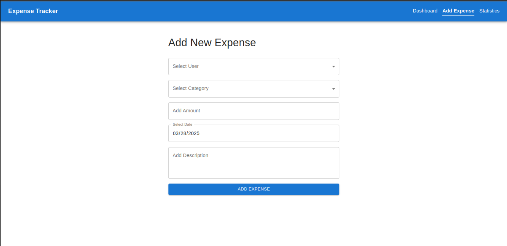
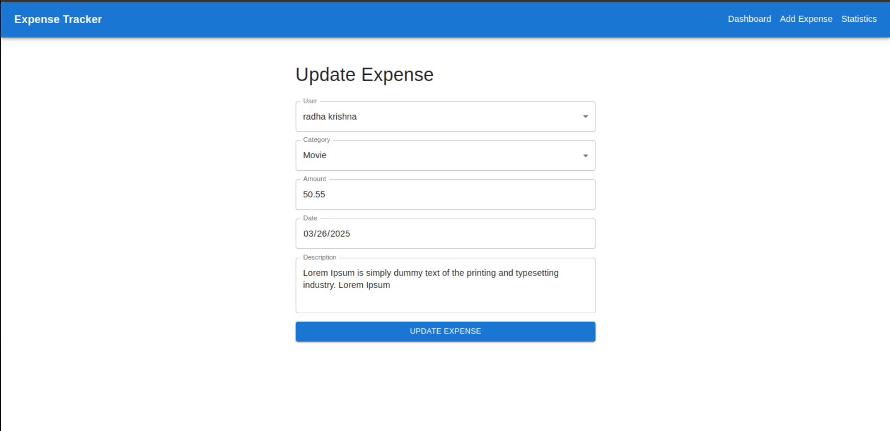
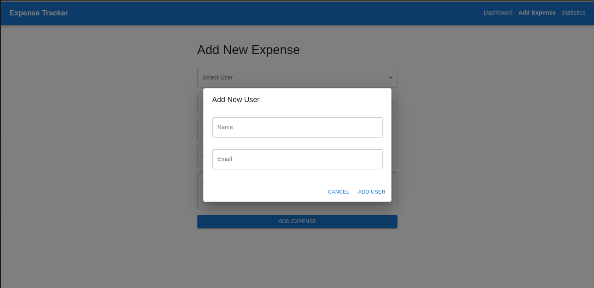
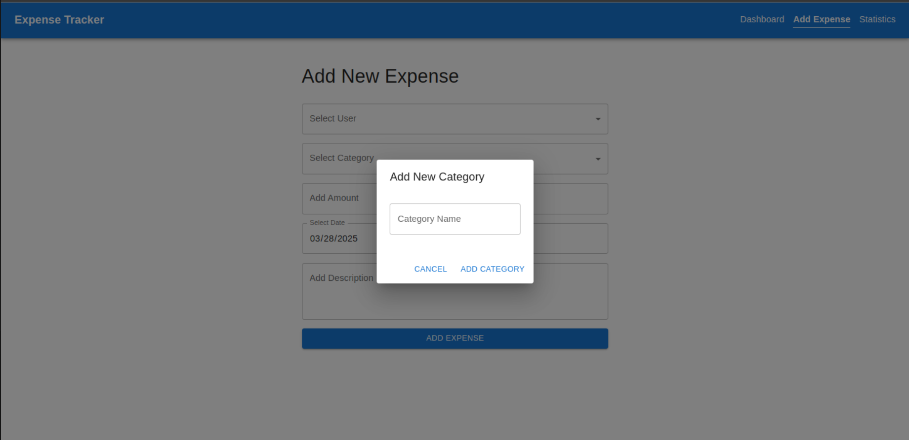
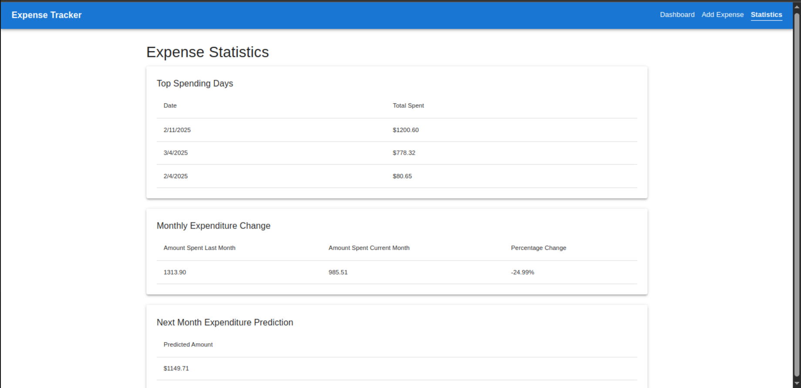

# Expense Tracker (MERN Stack)

## Project Overview

This is a MERN stack-based expense tracker application that allows users to manage their expenses efficiently. The project consists of a frontend built with React (using Vite) and a backend powered by Node.js, Express, and MySQL. The application provides features for adding, updating, deleting, and filtering expenses, along with various statistical reports.

## Features

### Frontend (React.js + Vite)

- Dashboard to manage expenses.
- Add expenses with user, category, date, amount, and description.
- Filter expenses by category, user, or date range.
- State management using Redux or React Query.

### Backend (Node.js + Express + MySQL)

- APIs to:
  - Add, update, and delete expenses.
  - Retrieve expenses based on filters.
  - Compute statistical reports:
    - **Statistic 1:** Find each user's top 3 days (by total expenditure), ordered by the total amount spent.
    - **Statistic 2:** Calculate the percentage change in total expenditure from the previous month for each user.
    - **Statistic 3:** Predict the next month's total expenditure based on the average spending of the last 3 months.
- Validations implemented at both client and server sides.

## Technologies Used

- **Frontend:** React.js (Vite), Redux/React Query, Tailwind CSS (if used)
- **Backend:** Node.js, Express.js, MySQL (without ORM)
- **Database:** MySQL
- **Others:** Postman (API testing), .env for environment variables

## Project Structure

```
Expense-Tracker/
│-- frontend/
│   │-- src/
│   │-- .env.example
│   │-- package.json
│   │-- README.md
│
│-- backend/
│   │-- src/
│   │-- .env.example
│   │-- package.json
│   │-- README.md
│   │-- index.js
│
│-- database/
│   │-- petpooja_practical.sql
│
│-- petpooja_practical.postman_collection.json
│
│-- README.md
```

## Installation & Setup

### Prerequisites

Ensure you have the following installed:

- Node.js
- MySQL
- npm or yarn

### Backend Setup

1. Navigate to the backend directory:
   ```sh
   cd backend
   ```
2. Install dependencies:
   ```sh
   npm install
   ```
3. Set up environment variables:
   - Copy `.env.example` to `.env` and update values accordingly.
4. Start the backend server:
   ```sh
   npm run start
   ```
   - The backend runs on **port 8000**.

### Frontend Setup

1. Navigate to the frontend directory:
   ```sh
   cd frontend
   ```
2. Install dependencies:
   ```sh
   npm install
   ```
3. Set up environment variables:
   - Copy `.env.example` to `.env` and update values accordingly.
4. Start the frontend application:
   ```sh
   npm run dev
   ```

## Database Setup

1. Create a MySQL database named `petpooja_practical`.
2. Import the SQL schema:
   ```sh
   mysql -u <your_username> -p petpooja_practical < database/petpooja_practical.sql
   ```

## API Testing

- Import `petpooja_practical.postman_collection.json` into Postman to test APIs.

## Screenshots

- **Dashboard:** 
- **Add Expense:** 
- **Update Expense:** 
- **Delete Expense:** 
- **Add User:** 
- **Add Category:** 
- **Statistics:** 
