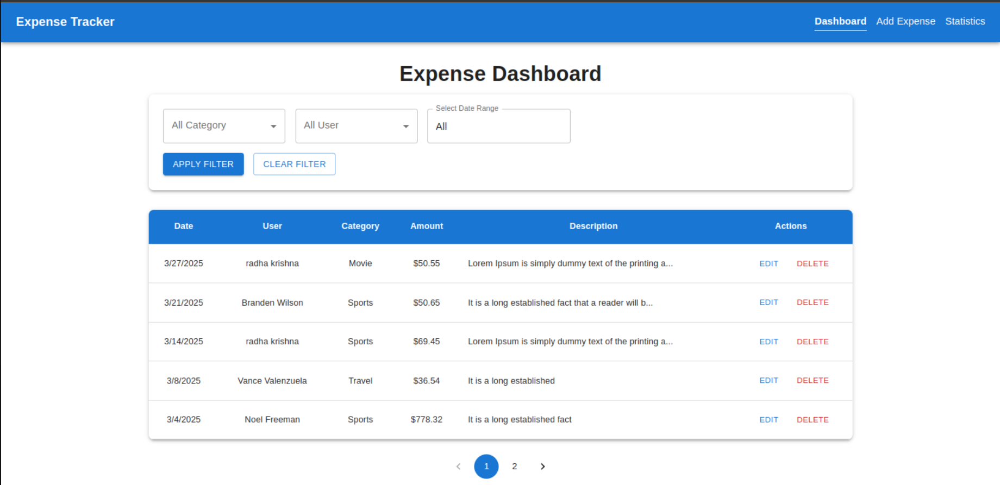
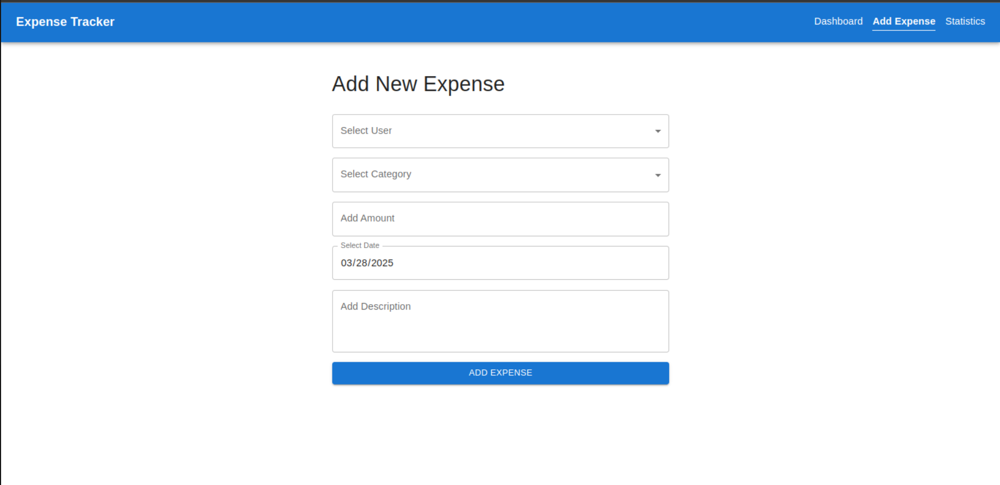
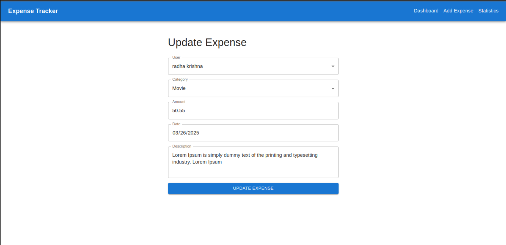
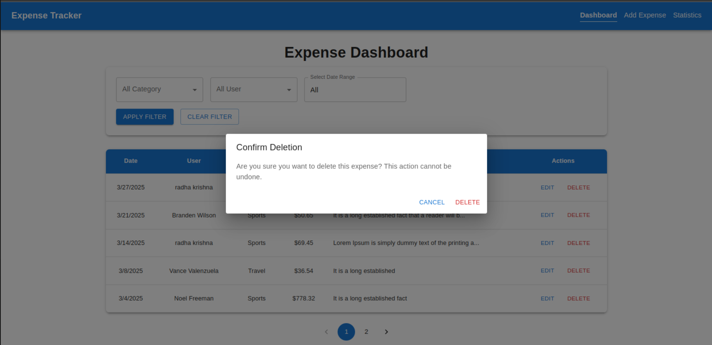
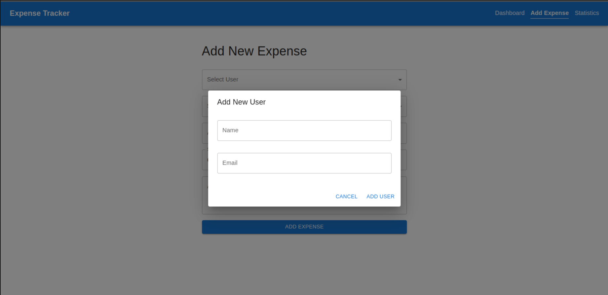
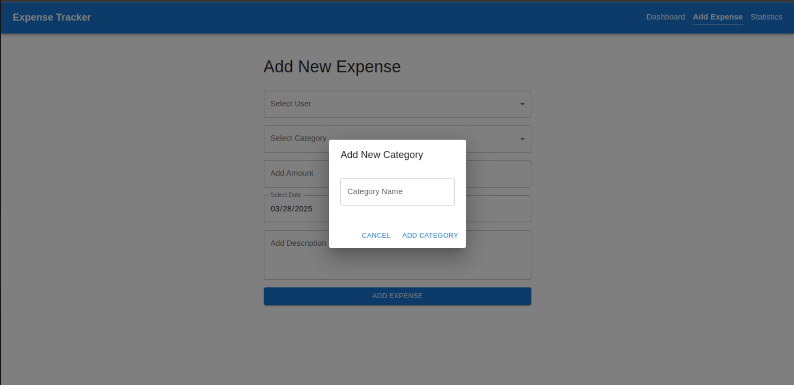
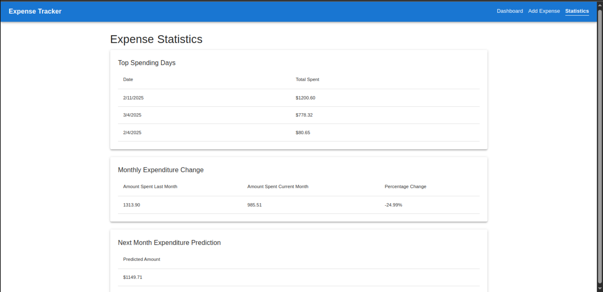

# Frontend - Expense Tracker

## Project Overview

This is the frontend application for the Expense Tracker, built using React.js (Vite). It provides a user-friendly dashboard to manage expenses, filter records, and view statistical insights.

## Features

- **Add Expenses:** Users can add expenses with user, category, amount, date, and description.
- **Filter Expenses:** Filter expenses by category, user, or date range.
- **Statistics Reports:** View spending trends and insights.
- **React Query:** Uses Tanstack Query.

## Technologies Used

- **React.js (Vite)** - Frontend framework
- **Material UI** - Styling

## Project Structure

```
frontend/
│-- src/
│   │-- components/
│   │-- pages/
│   │-- services/
│   │-- api/
│   │-- assests/
│   │-- utils/
│-- public/
│-- .env.example
│-- package.json
│-- README.md
```

## Setup Instructions

1. Navigate to the frontend directory:
   ```sh
   cd frontend
   ```
2. Install dependencies:
   ```sh
   npm install
   ```
3. Set up environment variables:
   - Copy `.env.example` to `.env` and update values accordingly.
4. Start the development server:
   ```sh
   npm run dev
   ```

## Screenshots

- **Dashboard:** 
- **Add Expense:** 
- **Update Expense:** 
- **Delete Expense:** 
- **Add User:** 
- **Add Category:** 
- **Statistics:** 
